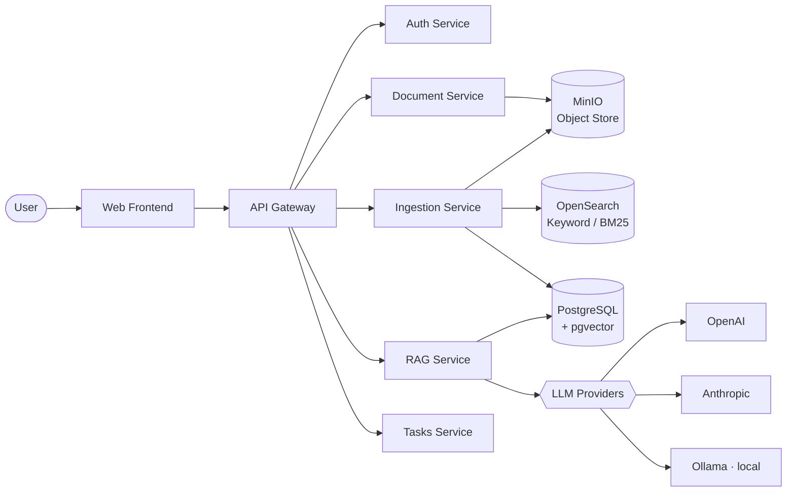

<h1 align="center">
  
</h1>

  <samp>I build <b>backend-heavy systems &amp; AI-assisted tools</b> — RAG pipelines · microservices · mobile apps</samp>

  
  
  
  
  

  

---

### 🧑‍💻 About Me

- 💼 **Software Engineer @ ENAGEO** — maintaining & optimizing core financial systems
- ⚙️ I build **backend-heavy systems and AI-assisted tools** — RAG pipelines, microservices & mobile apps
- 🧠 Currently going deep on **RAG systems**, **Python** & **Spring Boot**
- 🟢 **Open to backend / AI-engineering roles & collaborations**
- 🌐 Portfolio → **[abdelghani-mahammedii.netlify.app](https://abdelghani-mahammedii.netlify.app/)**
- ⚡ Fun fact: I respond faster than my API calls

---

### 🚀 Featured Projects

#### 🧠 Argo — Document-Intelligence RAG Platform

> A microservices **Retrieval-Augmented Generation** platform to search and chat over documents.

- 🔎 **Hybrid retrieval** — **PostgreSQL + pgvector** (semantic / embeddings) **+ OpenSearch** (keyword / BM25)
- 🤖 **Multi-LLM** RAG service — **OpenAI**, **Anthropic** & **Ollama** (local) behind a single interface
- 🧩 **FastAPI** microservices (`auth` · `document` · `ingestion` · `rag` · `tasks`) behind an **API gateway**
- 🗄️ **MinIO** object storage · **JWT** auth · fully **Dockerized** with health checks

🏗️ <b>Architecture</b> (click to expand)

 

#### 📱 Rahma — Cross-Platform Pharmacy App

> A modern mobile app built on a fully typed Expo stack.

| Layer | Tech |
| --- | --- |
| **Core** | Expo (SDK 53) · React Native 0.79 · React 19 · TypeScript |
| **UI / Nav** | Expo Router · NativeWind · Tailwind CSS v4 · `@rn-primitives` |
| **State / Data** | TanStack Query · Zustand · React Hook Form |
| **More** | i18n (expo-localization) · MMKV · Reanimated · EAS Build · Jest |

---

### 🛠️ Tech Stack

**AI Engineering & Tooling**

  
  
  
  
  
  
  
  

**Languages**

  
  
  
  
  
  

**Frontend & Mobile**

  
  
  
  
  

**Backend**

  
  
  
  
  
  

**Data & Infrastructure**

  
  
  
  
  
  
  
  

**Tools & IDEs**

  
  
  
  
  
  
  

---

### 📊 GitHub Stats

  
  

  

---

  <i>📫 Reach me at <b>wboductqr@relay.firefox.com</b> — I'll get back faster than a cold start. ❄️</i>

